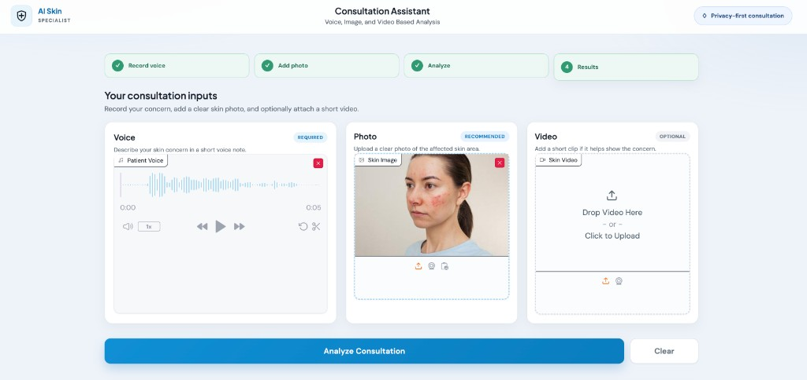
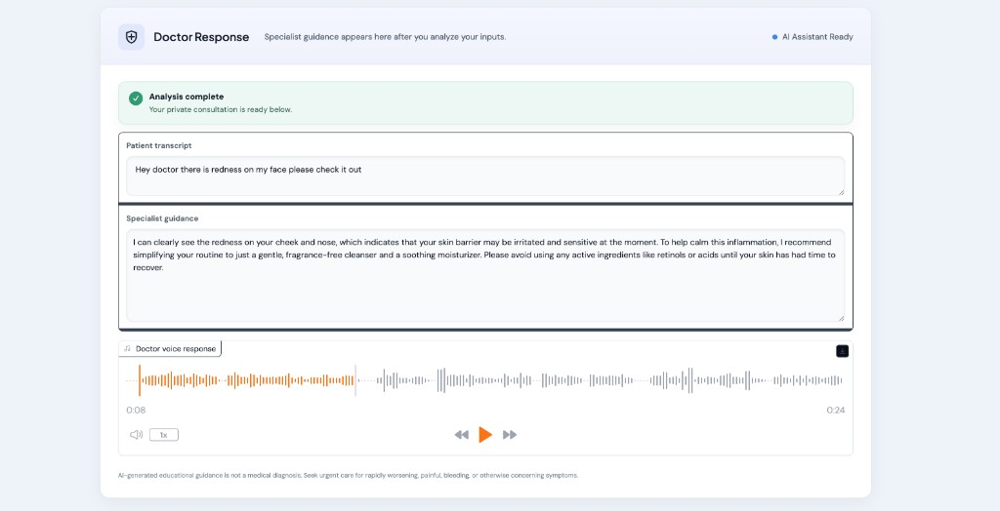

# Multimodal Medical Consultant

A multimodal AI consultation assistant for skin concerns. Patients describe symptoms with a short voice note, upload a clear photo (and optionally a short video), then receive specialist-style guidance as both text and spoken audio.

Built with **Python**, **Gradio**, **Groq** (speech-to-text + vision), and **Deepgram** (text-to-speech).

---

## Features

- **Voice input** — record a patient voice note describing the skin concern
- **Photo analysis** — upload a clear image of the affected area for vision-based review
- **Optional video** — attach a short clip when it helps show the concern
- **AI specialist guidance** — multimodal model reviews transcript + image and returns educational advice
- **Doctor voice response** — guidance is spoken aloud via Deepgram TTS
- **Guided consultation UI** — step strip, required/recommended/optional input tiles, and a clear results panel
- **Privacy-minded flow** — local Gradio app with an explicit educational disclaimer (not a medical diagnosis)

---

## Screenshots

### Consultation inputs

Record voice, add a skin photo, and optionally attach a video before analysis.



### Doctor response

After analysis, the app shows the patient transcript, specialist guidance, and a playable doctor voice response.



---

## How it works

1. **Transcribe** the patient voice note with Groq Whisper (speech-to-text)
2. **Analyze** the skin photo (and optional video context) with a Groq vision-language model
3. **Speak** the doctor-style reply with Deepgram Aura TTS
4. **Display** transcript, written guidance, and audio in the Gradio results panel

---

## Project layout

```
AI-SkinExpert/
├── main.py                 # App entrypoint
├── app/
│   ├── main.py             # Gradio app wiring
│   ├── pipeline.py         # STT → doctor vision → TTS pipeline
│   ├── patient_voice.py    # Voice transcription
│   ├── doctor_brain.py     # Multimodal doctor reasoning
│   ├── doctor_voice.py     # Text-to-speech
│   └── ui/                 # Layout, markup, theme, styles
├── samples/                # Demo media
└── docs/screenshots/       # README screenshots
```

---

## Requirements

- Python `>=3.9,<3.10`
- [uv](https://github.com/astral-sh/uv) (recommended) or another Python package manager
- API keys:
  - `GROQ_API_KEY`
  - `DEEPGRAM_API_KEY`

---

## Setup

1. Clone the repository and enter the project folder:

```bash
git clone <your-repo-url>
cd AI-SkinExpert
```

2. Create a `.env` file in the project root:

```env
GROQ_API_KEY=your_groq_api_key
DEEPGRAM_API_KEY=your_deepgram_api_key
```

3. Install dependencies and run:

```bash
uv sync
uv run python main.py
```

Open the local Gradio URL shown in the terminal to use the consultation assistant.

---

## Tech stack

| Area | Tools |
|------|--------|
| UI | Gradio, custom CSS |
| STT | Groq Whisper |
| Vision / LLM | Groq multimodal chat |
| TTS | Deepgram Aura |
| Audio / image | SpeechRecognition, pydub, Pillow |
| Config | python-dotenv, uv |

---

## Disclaimer

AI-generated educational guidance is **not** a medical diagnosis. Seek urgent care for rapidly worsening, painful, bleeding, or otherwise concerning symptoms.

---

## Contact

**Muhammad Aziz Ullah**  
Email: [m.azizullah420@gmail.com](mailto:m.azizullah420@gmail.com)
